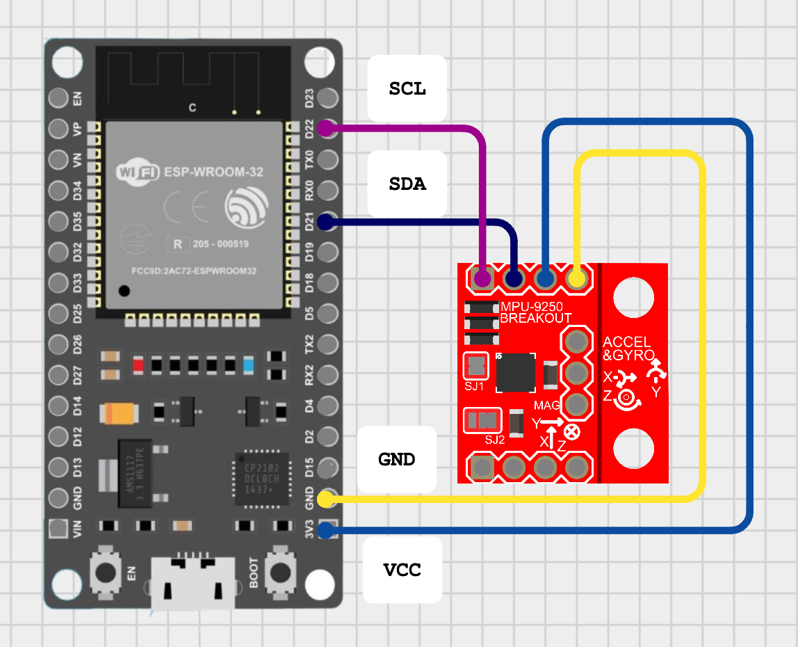

# Determinação de atitude utilizando MPU-9250 e ESP32
Readme update.
## Descrição do Projeto

Projeto para a determinação da atitude utilizando MPU-9250 e ESP32. São publicados os seguintes dados via WIFI.

* Giroscópio, 3 eixos,
* Acelerômetro, 3 eixos,
* Magnetômetro, 3 eixos,
* Temperatura em Celsius.

Utilizando filtro de Kalman, são gerados os seguintes dados:

* [x] atitude em ângulos de Euler, rolagem (roll), arfagem (pitch), guinada (yaw).
* [ ] atitude em quaterniões.
* [ ] taxas (p,q,r).

## Pré-requisitos

* PlatformIO em VSCode.
* MPU-9250
* ESP32
* OLED 0,96 inch 128x64

## Instalação

1. Clone o repositório
2. Instale as dependências
3. Abra a pasta no VScode.

## Uso

Implemente o circuito mostrado.

## Trabalho pendentes

* [x] Transmitir dados via WiFi.
* [x] Utilizar protocolo MQTT.
* [x] Finalizar visualização em tempo-real via WiFi. Utilizar Grafana.
* [x] Implementar filtro de Kalman.
* [x] Implementar fusão sensorial.

## Licença

GNU General Public License (GPL).

## Contato

Diego Paolo Ferruzzo Correa

diego.ferruzzo@ufabc.edu.br
